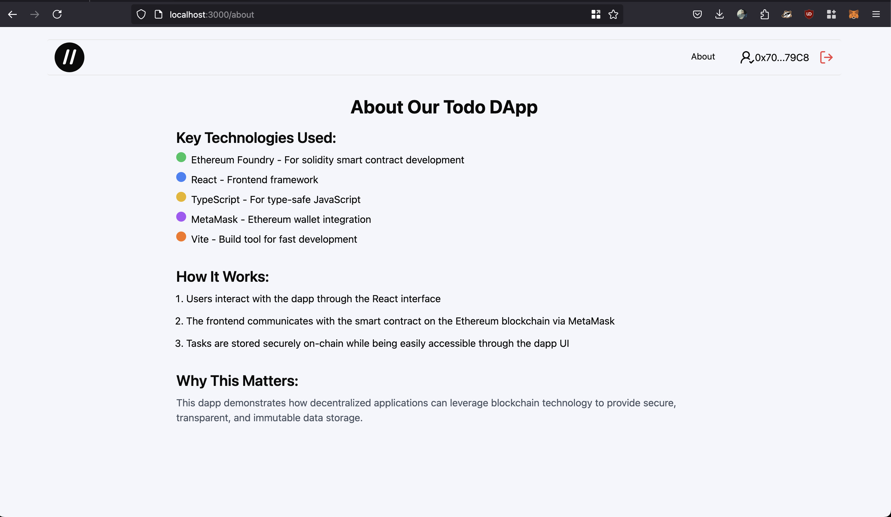

# Todo Dapp with Blockchain Storage

This project demonstrates a Todo List application built with React TypeScript and Vite in the frontend, paired with a Solidity smart contract created and deployed using Foundry. The app allows users to store multiple todos on the blockchain, perform CRUD operations (add, edit, delete, mark as done), and authenticate using MetaMask.

## Features

- Store multiple user todos on the blockchain
- Perform CRUD operations on todos
- Authentication using MetaMask
- Local Ethereum node (Anvil) for development
- Smart contract deployment using Forge

## Setup and Usage

### Prerequisites

- **Node.js** >= 20 and **npm** installed
- ""Foundry\*\* as smart contract development toolchain
- An **Ethereum node** (Anvil recommended for local development wich comes with Foundry)
- **Forge**: Ethereum testing framework
- **MetaMask** browser extension installed

### Steps to Run the App

1. Build the smart contract (optional)

```shell
$ forge build
```

2. Run the test (optional)

```shell
$ forge test
```

3. First, run Anvil for a local Ethereum node:

```shell
$ anvil
```

It is start local node with RPC URL `127.0.0.1:8545`

4. Deploy the smart contract using Forge:

```shell
$ forge script script/Todo.s.sol:TodoScript --rpc-url <your_rpc_url> --private-key <your_private_key>
```

5. Navigate to the webapp folder and start the frontend app:

```shell
npm run dev
```

6. Install MetaMask and add the local Anvil account
7. Connect to the app using MetaMask
8. Start using the Todo app

## Inspiration

While storing todos on the blockchain might seem unnecessary in real-world scenarios, this project serves as an educational example for learning blockchain development. It demonstrates how to interact with smart contracts and store data on-chain, which is crucial knowledge for many blockchain applications.

## Preview

1. Wallet Connect
   
   

2. Home Page
   
   

3. CRUD
   
   
   

4. About Page
   

5. Not Found Page
   
